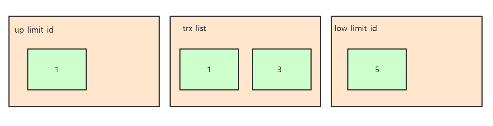
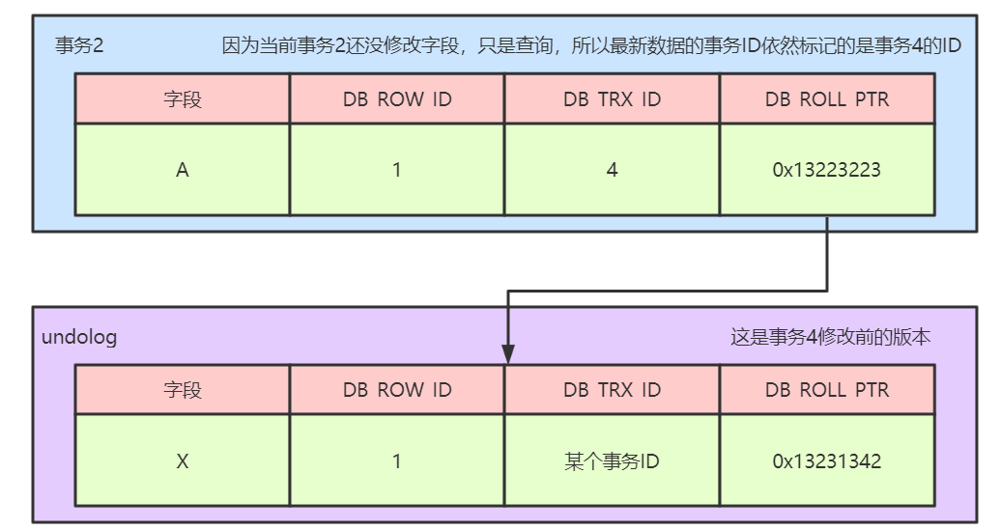

# MVCC多版本并发控制

&nbsp;

## 1、MVCC

​		`MVCC`，全称 `Multi-Version Concurrency Control`，即多版本并发控制。MVCC 是一种并发控制的方法，一般在数据库管理系统中，实现对数据库的并发访问，在编程语言中实现事务内存。

 		MVCC 在 MySQL InnoDB 引擎中的实现主要是为了提高数据库并发性能，用更好的方式去处理读写冲突，做到即使有读写冲突时，也能做到不加锁，非阻塞并发读。

&nbsp;

## 2、当前读

​		像 `select lock in share mode`(共享锁), `select for update` ; `update`, `insert `,`delete` (排他锁) 这些操作都是一种当前读，为什么叫当前读？就是它读取的是记录的最新版本，读取时还要保证其他并发事务不能修改当前记录，会对读取的记录进行加锁。

&nbsp;

## 3、快照读（提高数据库的并发查询能力）

​		像不加锁的 select 操作就是快照读，即不加锁的非阻塞读；快照读的前提是隔离级别不是串行级别，串行级别下的快照读会退化成当前读；之所以出现快照读的情况，是基于提高并发性能的考虑，快照读的实现是基于多版本并发控制，即MVCC,可以认为 MVCC 是行锁的一个变种，但它在很多情况下，避免了加锁操作，降低了开销；既然是基于多版本，即快照读可能读到的并不一定是数据的最新版本，而有可能是之前的历史版本。

&nbsp;

## 4、当前读、快照读、MVCC 关系

​		MVCC 多版本并发控制指的是维持一个数据的多个版本，使得读写操作没有冲突，快照读是 MySQL 为实现 MVCC 的一个非阻塞读功能。MVCC 模块在 MySQL 中的具体实现是由三个隐式字段，`undo` 日志、`read view` 三个组件来实现的。

&nbsp;

## 5、MVCC解决的问题

​		数据库并发场景有三种，分别为：

​		1、读读：不存在任何问题，也不需要并发控制

​		2、读写：有线程安全问题，可能会造成事务隔离性问题，可能遇到脏读、幻读、不可重复读

​		3、写写：有线程安全问题，可能存在更新丢失问题

​		MVCC 是一种用来解决读写冲突的无锁并发控制，也就是为事务分配单项增长的时间戳，为每个修改保存一个版本，版本与事务时间戳关联，读操作只读该事务开始前的数据库的快照，所以 MVCC 可以为数据库解决一下问题：

​		1、在并发读写数据库时，可以做到在读操作时不用阻塞写操作，写操作也不用阻塞读操作，提高了数据库并发读写的性能

​		2、解决脏读、幻读、不可重复读等事务隔离问题，但是不能解决更新丢失问题

&nbsp;

## 6、MVCC实现原理

​		`mvcc` 的实现原理主要依赖于记录中的三个隐藏字段，`undolog`，`read view`来实现的。

​		**隐藏字段**

​		每行记录除了我们自定义的字段外，还有数据库隐式定义的  `DB_TRX_ID` , `DB_ROLL_PTR` , `DB_ROW_ID`  等字段

​		`DB_TRX_ID`

​		$6$ 字节，最近修改事务id，记录创建这条记录或者最后一次修改该记录的事务 id

​		`DB_ROLL_PTR`

​		$7$ 字节，回滚指针，指向这条记录的上一个版本,用于配合 `undolog`，指向上一个旧版本

​		`DB_ROW_JD`

​		$6$ 字节，隐藏的主键，如果数据表没有主键，那么 innoDB 会自动生成一个 6 字节的 row_id

​		记录如图所示：


**undo log**

​		undolog被称之为回滚日志，表示在进行 insert，delete，update 操作的时候产生的方便回滚的日志

​		当进行 insert 操作的时候，产生的 undolog 只在事务回滚的时候需要，并且在事务提交之后可以被立刻丢弃

​		当进行 update 和 delete 操作的时候，产生的 undolog 不仅仅在事务回滚的时候需要，在快照读的时候也需要，所以不能随便删除，只有在快照读或事务回滚不涉及该日志时，对应的日志才会被 `purge` 线程统一清除（当数据发生更新和删除操作的时候都只是设置一下老记录的 `deleted_bit`，并不是真正的将过时的记录删除，因为为了节省磁盘空间，innodb 有专门的 purge 线程来清除`deleted_bit` 为 `true` 的记录，如果某个记录的 `deleted_id` 为 `true`，并且 `DB_TRX_ID` 相对于 `purge` 线程的 `read view` 可见，那么这条记录一定时可以被清除的）

&nbsp;

​		**下面我们来看一下 `undolog` 生成的记录链**

​		1、假设有一个事务编号为1的事务向表中插入一条记录，那么此时行数据的状态为：


​		2、假设有第二个事务编号为2对该记录的name做出修改，改为lisi

​		在事务2修改该行记录数据时，数据库会对该行加排他锁

​		然后把该行数据拷贝到 undolog 中，作为旧记录，即在 undolog 中有当前行的拷贝副本

​		拷贝完毕后，修改该行 name 为 lisi，并且修改隐藏字段的事务 id 为当前事务 2 的 id，回滚指针指向拷贝到 undolog 的副本记录中

​		事务提交后，释放锁


&nbsp;

​		3、假设有第三个事务编号为3对该记录的age做了修改，改为32

​		在事务3修改该行数据的时，数据库会对该行加排他锁

​		然后把该行数据拷贝到undolog中，作为旧纪录，发现该行记录已经有undolog了，那么最新的旧数据作为链表的表头，插在该行记录的undolog最前面

​		修改该行age为32岁，并且修改隐藏字段的事务id为当前事务3的id，回滚指针指向刚刚拷贝的undolog的副本记录

​		事务提交，释放锁


​		从上述的一系列图中，大家可以发现，不同事务或者相同事务的对同一记录的修改，会导致该记录的 undolog 生成一条记录版本线性表，即链表，undolog 的链首就是最新的旧记录，链尾就是最早的旧记录。

​		**Read View**

​		上面的流程如果看明白了，那么大家需要再深入理解下 read view 的概念了。

​		Read View是事务进行快照读操作的时候生产的读视图，在该事务执行快照读的那一刻，会生成一个数据系统当前的快照，记录并维护系统当前活跃事务的id，事务的id值是递增的。

​		其实Read View的最大作用是用来做可见性判断的，也就是说当某个事务在执行快照读的时候，对该记录创建一个 Read View 的视图，把它当作条件去判断当前事务能够看到哪个版本的数据，有可能读取到的是最新的数据，也有可能读取的是当前行记录的 undolog 中某个版本的数据

​		Read View 遵循的可见性算法主要是将要被修改的数据的最新记录中的 DB_TRX_ID（当前事务id）取出来，与系统当前其他活跃事务的id去对比，如果 DB_TRX_ID 跟 Read View 的属性做了比较，不符合可见性，那么就通过 DB_ROLL_PTR 回滚指针去取出 undolog 中的 DB_TRX_ID 做比较，即遍历链表中的 DB_TRX_ID，直到找到满足条件的 DB_TRX_ID ,这个 DB_TRX_ID 所在的旧记录就是当前事务能看到的最新老版本数据。

​		Read View 的可见性规则如下所示：

​		首先要知道 Read View 中的三个全局属性：

​		trx_list: 一个数值列表，用来维护 Read View 生成时刻系统正活跃的事务ID（1,2,3）

​		up_limit_id:记录trx_list列表中事务ID最小的ID（1）

​		low_limit_id: Read View生成时刻系统尚未分配的下一个事务ID，（4）

​		具体的比较规则如下：

​		1、首先比较DB_TRX_ID < up_limit_id,如果小于，则当前事务能看到DB_TRX_ID所在的记录，如果大于等于进入下一个判断

​		2、接下来判断 DB_TRX_ID >= low_limit_id,如果大于等于则代表 DB_TRX_ID 所在的记录在 Read View 生成后才出现的，那么对于当前事务肯定不可见，如果小于，则进入下一步判断

​		3、判断 DB_TRX_ID 是否在活跃事务中，如果在，则代表在 Read View 生成时刻，这个事务还是活跃状态，还没有 commit ，修改的数据，当前事务也是看不到，如果不在，则说明这个事务在 Read View 生成之前就已经开始 commit，那么修改的结果是能够看见的。

&nbsp;

## 7、MVCC的整体处理流程

假设有四个事务同时在执行，如下图所示：

|  事务1   |  事务2   |  事务3   |    事务4     |
| :------: | :------: | :------: | :----------: |
| 事务开始 | 事务开始 | 事务开始 |   事务开始   |
|  ......  |  ......  |  ......  | 修改且已提交 |
|  进行中  |  快照读  |  进行中  |              |
|  ......  |  ......  |  ......  |              |

从上述表格中，我们可以看到，当事务2对某行数据执行了快照读，数据库为该行数据生成一个 Read View 视图，可以看到 事务1 和 事务3 还在活跃状态，事务 4 在事务 2 快照读的前一刻提交了更新，所以，在 Read View 中记录了系统当前活跃事务 1，3，维护在一个列表中。同时可以看到 up_limit_id 的值为 1，而 low_limit_id 为 5 ，如下图所示：



在上述的例子中，只有事务 4 修改过该行记录，并在事务 2 进行快照读前，就提交了事务，所以该行当前数据的 undolog 如下所示：



​		当事务2在快照读该行记录的是，会拿着该行记录的DB_TRX_ID去跟up_limit_id,lower_limit_id和活跃事务列表进行比较，判读事务2能看到该行记录的版本是哪个。

​		具体流程如下：先拿该行记录的事务ID（4）去跟Read View中的up_limit_id (1) 相比较，判断是否小于，通过对比发现不小于，所以不符合条件，继续判断 4 是否大于等于 low_limit_id (5) ,通过比较发现也不大于，所以不符合条件，判断事务 $4$ 是否处理 trx_list 列表中，发现不在，那么符合可见性条件，所以事务 4 修改后提交的最新结果对事务 2 的快照是可见的，因此，事务 $2$ 读取到的最新数据记录是事务 $4$ 所提交的版本，而事务 $4$ 提交的版本也是全局角度的最新版本。如下图所示：


当上述的内容都看明白了的话，那么大家就应该能够搞清楚这几个核心概念之间的关系了，下面我们讲一个不同的隔离级别下的快照读的不同。

&nbsp;

## 8、RC、RR 级别下的InnoDB快照读有什么不同

### RR

```mysql
trx 1: 
mysql > set session transaction isolation level repeatable read;
create table t1(id int primary key, name varchar(20), age int);

insert into t2 values (1, '1', 1), (2, '2', 2);
commit;
begin;
select * from t1;
-- 有 2 条记录

trx 2:
select * from t1;
insert into t1 values(3, '3', 3);
commit;

trx 1: 
select * from t1;
-- 只有 2 条记录
```

&nbsp;

### RC

```mysql
trx 1: 
mysql > set session transaction isolation level read committed;
create table t1(id int primary key, name varchar(20), age int);

insert into t2 values (1, '1', 1), (2, '2', 2);
commit;
begin;
select * from t1;
-- 有 2 条记录

trx 2:
select * from t1;
insert into t1 values(3, '3', 3);
commit;

trx 1: 
select * from t1;
-- 有 3 条记录
```

&nbsp;

​		因为 Read View 生成时机的不同，从而造成 RC、RR 级别下快照读的结果的不同

​		1、在RR级别下的某个事务的对某条记录的第一次快照读会创建一个快照即Read View, 将当前系统活跃的其他事务记录起来，此后在调用快照读的时候，还是使用的是同一个Read View,所以只要当前事务在其他事务提交更新之前使用过快照读，那么之后的快照读使用的都是同一个Read View, 所以对之后的修改不可见

​		2、在RR级别下，快照读生成Read View时，Read View会记录此时所有其他活动和事务的快照，这些事务的修改对于当前事务都是不可见的，而早于Read View创建的事务所做的修改均是可见

​		3、在RC级别下，事务中，每次快照读都会新生成一个快照和Read View,这就是我们在RC级别下的事务中可以看到别的事务提交的更新的原因。

​		**总结：在RC隔离级别下，是每个快照读都会生成并获取最新的 Read View ,而在 RR 隔离级别下，则是同一个事务中的第一个快照读才会创建 Read View，之后的快照读获取的都是同一个 Read View.**			